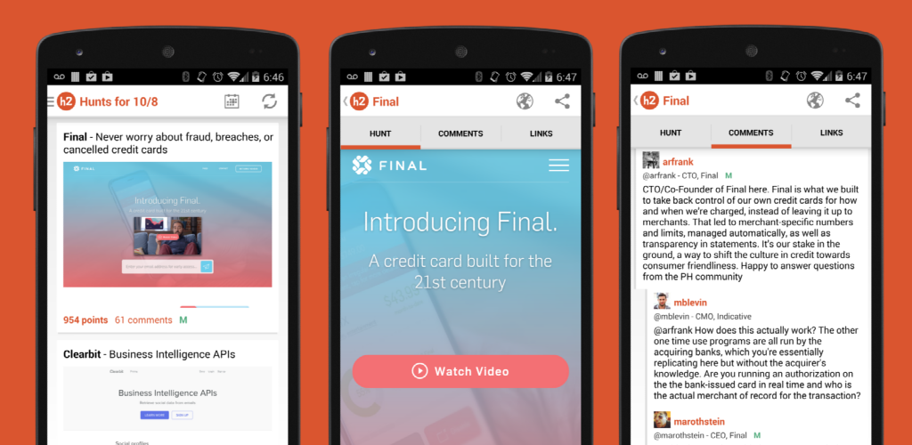
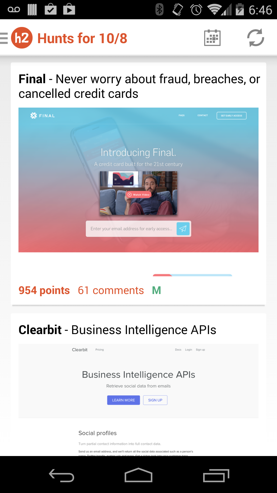
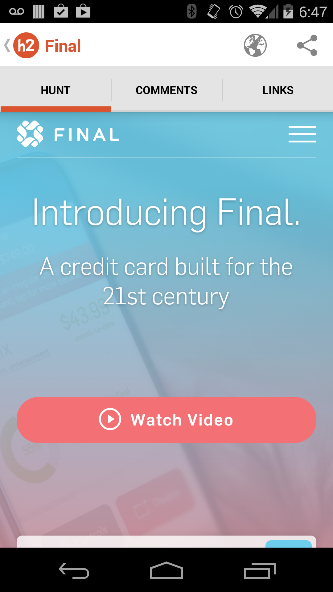
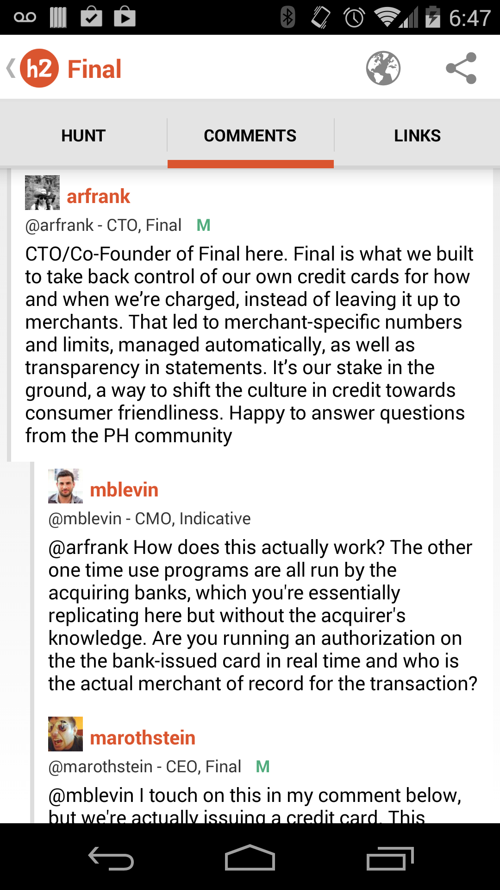
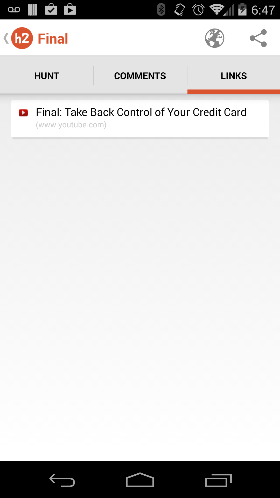

hunter2 - Product Hunt Client for Android
=====================================

Play Store link: https://play.google.com/store/apps/details?id=com.qrazhan.hunter2

hunter2 was the first Product Hunt client on the Play Store.  It makes use of the [Product Hunt API](http://www.producthunt.com/v1/docs).

Current list of features:
-------------------------
* Browsing current and past posts
* Viewing a post's link
* Read comments on a post
* View a post's related links
* Share either the post or the link

Features to be added (when the API opens up):
---------------------------
* Logging in
* Submitting new Hunts
* Voting and commenting

More Screenshots:
-----------------

